# RAG

## 📚 LangChain Retrieval Flow with History Awareness

### Diagram

```mermaid
flowchart TD

    subgraph A["1️⃣ User Input + Chat History"]
        U[User input: How old is he?]
        H[Chat history: Who is the CEO of Google? → Sundar Pichai]
    end

    subgraph B["2️⃣ History-Aware Retriever"]
        Q[LLM reformulates input into Search Query]
        D[Retriever fetches relevant docs]
    end

    subgraph C["3️⃣ Retrieval Chain"]
        R[createRetrievalChain combines query + docs]
        L[LLM generates grounded response]
    end

    U --> B
    H --> B
    B --> Q
    Q --> D
    D --> R
    Q --> R
    R --> L
```

### 🔎 Step-by-Step

1. **User Input + Chat History**

   - Collects the user’s latest message.
   - Optionally uses previous conversation for context.

2. **History-Aware Retriever (`createHistoryAwareRetriever`)**

   - If history exists → LLM rewrites the message into a **search query**.
   - Passes query to the **retriever** (e.g., vector store) to fetch relevant docs.

3. **Retrieval Chain (`createRetrievalChain`)**

   - Takes the **reformulated query** + **retrieved documents**.
   - Builds a prompt and sends it to the LLM.
   - LLM returns a **grounded final answer**.

### ✨ Example

**Chat History:**

User: Who is the CEO of Google?
AI: Sundar Pichai
User: How old is he?

**History-Aware Retriever:**

- Input: `"How old is he?"`
- Reformulated Search Query: `"How old is Sundar Pichai, the CEO of Google?"`
- Retrieved Docs: Info about Sundar Pichai
- Final Answer: `"Sundar Pichai is 52 years old."`

---

## 📖 Key Terms in LangChain

### 🔗 Chain

A **Chain** is a sequence of steps that link components together in LangChain.  
Each chain takes an input, processes it (sometimes through multiple steps), and produces an output.  
For example, a chain might:

- Take user input
- Retrieve documents
- Format a prompt
- Call an LLM
- Return the response

### 📑 Retriever

A **Retriever** is a component responsible for fetching relevant documents based on a query.  
It does not generate answers itself — instead, it returns raw documents (from a vector store, database, etc.) that the LLM can later use to answer questions.

### 🕰️ History-Aware Retriever

A **History-Aware Retriever** is an enhanced retriever that takes into account the **chat history** when forming the search query.

- If there is no history → passes the query as-is to the retriever.
- If there is history → the LLM rewrites the user’s question into a **self-contained search query** (removes ambiguity).  
  This makes retrieval robust in multi-turn conversations.

### 📚 Search Query

A **Search Query** is the reformulated, context-complete version of the user’s input.  
It’s generated (when needed) by the History-Aware Retriever.  
Example:

- Input: `"How old is he?"`
- Search Query: `"How old is Sundar Pichai, the CEO of Google?"`

### 🧩 `createHistoryAwareRetriever`

A LangChain utility that creates a retriever capable of using conversation history.  
It decides whether to:

- Pass the raw query (no history), or
- Ask the LLM to rewrite the query into a **Search Query** (if history exists).

### 🔎 `createRetrievalChain`

A LangChain utility that builds a chain for question-answering with retrieved documents.  
It:

1. Takes the **query** (raw or reformulated).
2. Accepts **retrieved documents** from the retriever.
3. Combines them into a **final prompt template**.
4. Calls the LLM with this prompt.
5. Returns the **grounded final answer**.

## 📝 Example Pipeline Recap

1. **User Input + Chat History** → Collects conversation.
2. **History-Aware Retriever (`createHistoryAwareRetriever`)** → Reformulates query (if needed) + fetches docs.
3. **Retrieval Chain (`createRetrievalChain`)** → Builds final LLM prompt (query + docs) → gets final answer.
