# RAG

## 📚 LangChain Retrieval Flow with History Awareness

### Diagram

```mermaid
flowchart TD

    subgraph A["1️⃣ User Input + Chat History"]
        U[User input: How old is he?]
        H[Chat history: Who is the CEO of Google? → Sundar Pichai]
    end

    subgraph B["2️⃣ History-Aware Retriever"]
        Q[LLM reformulates input into Search Query]
        D[Retriever fetches relevant docs]
    end

    subgraph C["3️⃣ Retrieval Chain"]
        R[createRetrievalChain combines query + docs]
        L[LLM generates grounded response]
    end

    U --> B
    H --> B
    B --> Q
    Q --> D
    D --> R
    Q --> R
    R --> L
```



### 🔎 Step-by-Step

1. **User Input + Chat History**

   - Collects the user’s latest message.
   - Optionally uses previous conversation for context.

2. **History-Aware Retriever (`createHistoryAwareRetriever`)**

   - If history exists → LLM rewrites the message into a **search query**.
   - Passes query to the **retriever** (e.g., vector store) to fetch relevant docs.

3. **Retrieval Chain (`createRetrievalChain`)**

   - Takes the **reformulated query** + **retrieved documents**.
   - Builds a prompt and sends it to the LLM.
   - LLM returns a **grounded final answer**.

### ✨ Example

**Chat History:**

- User: `Who is the CEO of Google?`
- AI: `Sundar Pichai`
- User: `How old is he?`

**History-Aware Retriever:**

- Input: `"How old is he?"`
- Reformulated Search Query: `"How old is Sundar Pichai, the CEO of Google?"`
- Retrieved Docs: Info about Sundar Pichai
- Final Answer: `"Sundar Pichai is 52 years old."`

---

## 📖 Key Terms in LangChain

### 🔗 Chain

A **Chain** is a sequence of steps that link components together in LangChain. Chains orchestrate workflows by passing the output of one component as input to the next. Each chain takes an input, processes it, and produces an output when invoked. Sometimes it has multiple steps.

For example, a chain might:

- Take user input
- Retrieve documents
- Format a prompt
- Call an LLM
- Return the response

### 📑 Retriever

A **Retriever** is a component responsible for fetching relevant documents based on a query.  
It does not generate answers itself instead, it returns raw documents (from a vector store, database, etc.) that the LLM can later use to answer questions.

### 🕰️ History-Aware Retriever

A **History-Aware Retriever** is an enhanced retriever that takes into account the **chat history** when forming the search query.

- If there is no history → passes the query as-is to the retriever.
- If there is history → the LLM rewrites the user’s question into a **self-contained search query** (removes ambiguity).  
  This makes retrieval robust in multi-turn conversations.

### 📚 Search Query

A **Search Query** is the reformulated version of the user’s input.  
It’s generated by the History-Aware Retriever.

Example:

**Conversation History:**

```
User: Who is the CEO of Google?
AI: Sundar Pichai.
User: How old is he?
```

- Input: `"How old is he?"`
- Search Query: `"How old is Sundar Pichai, the CEO of Google?"`

**Without history:**
Retriever would just see `"How old is he?"` which is ambiguous.

**With history (via createHistoryAwareRetriever):**

The LLM rewrites it into a search query: `"How old is Sundar Pichai, the CEO of Google?"`

### 🧩 `createHistoryAwareRetriever`

A LangChain utility that creates a retriever capable of using conversation history.  
It decides whether to:

- Pass the raw query (no history), or
- Ask the LLM to rewrite the query into a **Search Query** (if history exists).

Here are the steps it takes:

- Takes `chat_history` + latest user input.
- If `chat_history` exists → LLM rewrites the user input into a **reformulated query** (aka _search query_).
- If no history → it just uses the input as-is.
- That query is then passed into the **retriever** (e.g., vector store retriever) to get relevant documents.

### 🔎 `createRetrievalChain`

A LangChain utility that builds a chain for **question-answering with retrieved documents**.

Here are the steps it takes:

1. It takes the **retriever output** (retrieved documents) + the **query** (reformulated or raw).
2. Combines them into a **final prompt template**.
3. Calls the LLM with this prompt.
4. Returns the **grounded final answer**.

### 📦 `createStuffDocumentsChain`

A LangChain utility that builds a chain specifically for **stuffing documents into a single prompt**.

- It takes multiple documents returned by a retriever.
- Concatenates ("stuffs") them into a single string.
- Places them into a prompt template along with the query.
- Sends the whole stuffed prompt to the LLM.

This is simple and works well for **small sets of documents**, but may hit token limits for large contexts.

Example Prompt (simplified):

```
Use the following documents to answer the question:
{docs}

Question: {query}
```

## 📝 Example Pipeline Recap

1. **User Input + Chat History** → Collects conversation.
2. **History-Aware Retriever (`createHistoryAwareRetriever`)** → Reformulates query (if needed) + fetches docs.
3. **Retrieval Chain (`createRetrievalChain`)** → Builds final LLM prompt (query + docs).
   - Often uses **`createStuffDocumentsChain`** under the hood to insert documents into the prompt.
4. **LLM** → Produces the grounded final answer.
